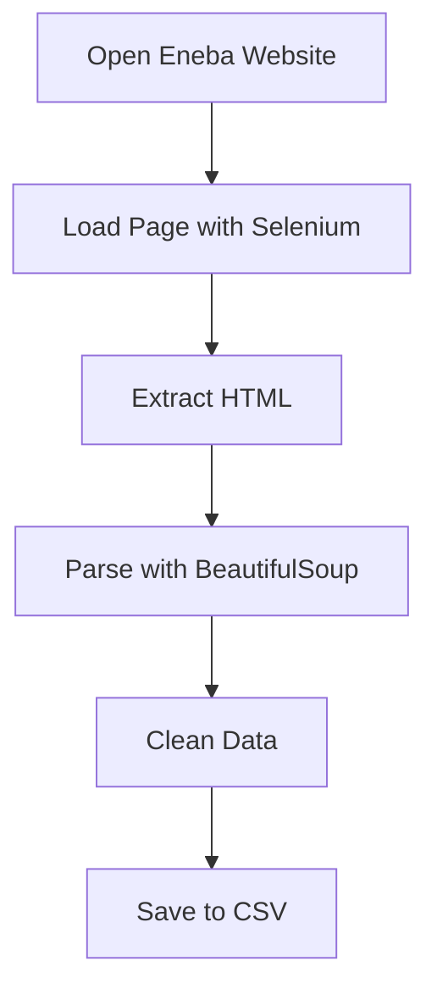

# 🎮 Eneba Web Scraping

> Extracting game product data from Eneba automatically using Python

---

## 📌 About The Project
This project is an implementation of **web scraping** to automatically collect digital game product data from the Eneba website.

By leveraging tools such as Selenium and BeautifulSoup, this project extracts important information from dynamic web pages and transforms it into structured data ready for further use.

---

## 🎯 What This Project Does
- 🔍 Scrapes product data directly from the Eneba website  
- ⚡ Handles dynamic web pages using automation  
- 🧹 Cleans and structures scraped data  
- 📦 Stores data in structured formats (CSV / DataFrame)  

---

## 🛠️ Tech Stack
This project uses:
- **Python**
- **Selenium**
- **BeautifulSoup**
- **Pandas**

---

## ⚙️ How It Works


---

## 📊 Data Collected
The scraped data includes:
- 🎮 Game product name  
- 💰 Price  
- ⭐ Rating (if available)  
- 🌍 Additional information (platform / region)  

---

## 🚀 Getting Started

### 1. Clone Repository
```bash
git clone https://github.com/Chandra171/Eneba-Web-Scraping.git
cd Eneba-Web-Scraping
```

### 2. Install Dependencies
```bash
pip install -r requirements.txt
```

### 3. Run the Script
```bash
python main.py
```

---

## ⚠️ Important Notes
- Website structure may change at any time  
- Use web scraping responsibly and follow website policies  
- Ensure a stable internet connection when running the script  

---

## ✨ Highlights
✔ Automated scraping for dynamic websites  
✔ Structured data extraction  
✔ Clean and simple workflow  
✔ Suitable for Data Analyst / Data Engineer portfolio  

---
